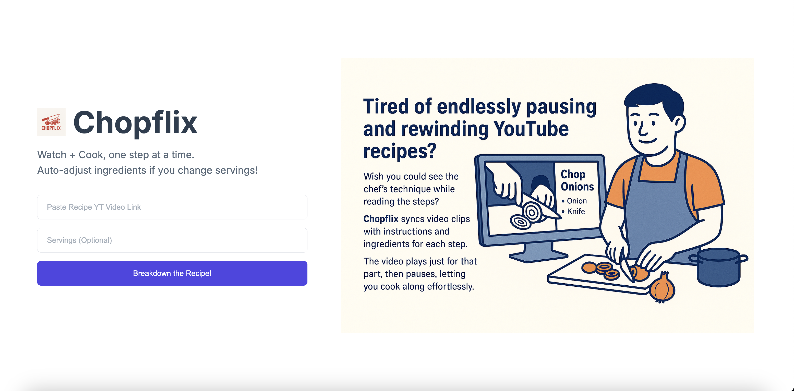

# Chopflix - Your YouTube Recipe Co-Pilot

Tired of endlessly pausing and rewinding YouTube recipes? Wish you could see the chef's technique while reading the steps? Chopflix syncs video clips with instructions and ingredients for each step. The video plays just for that part, then pauses, letting you cook along effortlessly.

## Key Features

*   **Step-by-Step Video Playback**: Extracts recipe steps from a YouTube video URL and plays the relevant video segment for each step.
*   **Per-Step Ingredients**: Displays only the ingredients needed for the current step.
*   **Servings Adjustment (Optional)**: Tell the AI your desired serving size, and it can adjust ingredient quantities (experimental).
*   **Interactive Navigation**: Easily move between recipe steps.
*   **Modern UI**: A clean and intuitive interface for a smooth cooking experience.

## How to Use

1.  **Clone the Repository:**
    ```bash
    git clone <your-repo-url>
    cd <repository-folder>
    ```
2.  **Add Your Gemini API Key:**
    *   Open the `script.js` file.
    *   Find the line: `const GEMINI_API_KEY = "YOUR_GEMINI_API_KEY";` (or a placeholder key like "AIzaSy...")
    *   **Replace `"YOUR_GEMINI_API_KEY"` with your actual Google Gemini API key.**
    *   If you don't have one, you can get it from [Google AI Studio](https://aistudio.google.com/app/apikey).

3.  **Open `index.html` in Your Browser:**
    *   Simply open the `index.html` file in your web browser to start using Chopflix. No complex build steps are required.

4.  **Get Cooking!**
    *   Paste a YouTube recipe video URL into the input field.
    *   Optionally, enter your desired number of servings.
    *   Click "Breakdown the Recipe!" and let Chopflix guide you.

## Technologies Used

*   HTML5
*   CSS3
*   JavaScript (Vanilla)
*   [YouTube IFrame Player API](https://developers.google.com/youtube/iframe_api_reference)
*   [Google Gemini API](https://ai.google.dev/docs/gemini_api_overview)

## Contributing

Feel free to fork this project, make improvements, and submit pull requests! 